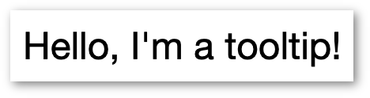

# Tooltipper

Simple tooltips on hover. Compatible with modern browsers only (ES6+).



## Usage

```
let ttipr = new Tooltipper(bgColor, txtColor, bdrRadius);
ttipr.init(); // Initialize all elements with 'data-tooltipper' attribute

ttipr.add(elem); // Add element after initialize
```

### [MIT License](https://en.wikipedia.org/wiki/MIT_License) 2020
